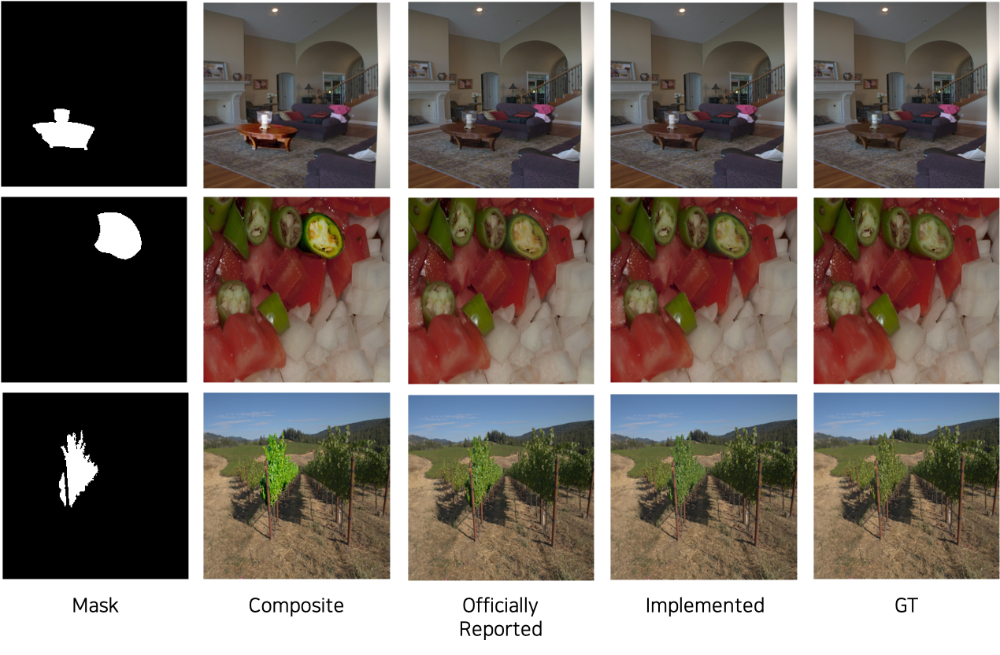

<base target="_blank"/>

# CDTNet: High-Resolution Image Harmonization via Collaborative Dual Transformations (CVPR 2022)

Unofficial implementation of "High-Resolution Image Harmonization via Collaborative Dual Transformations (CVPR 2022)" in PyTorch.

## Example Results
</img>

## Prerequisites

- Linux
- Python 3
- CPU or NVIDIA GPU + CUDA CuDNN

## Datasets
- [HAdobe5k](https://github.com/bcmi/Image-Harmonization-Dataset-iHarmony4)

## Train
1. Download HRNet-W18-C model(hrnetv2_w18_imagenet_pretrained.pth) in [HRNets](https://github.com/HRNet/HRNet-Image-Classification)
2. Put it in the `pretrained` folder.
3. Run:
```bash 
CUDA_VISIBLE_DEVICES="0,1,2,3,4,5,6,7" python train.py --model iih_base --name iih_base_allidh_test --dataset_root ~/IHD/ --dataset_name HAdobe5k --batch_size 80 --init_port 50000
```

## Test
### Train a new model

If you train a new model with the command above, `latest_net_G.pth` and `latest_net_P2P.pth` will be generated in the directory `checkpoints/iih_base_lt_allihd`.

Run:

```bash
CUDA_VISIBLE_DEVICES="0,1,2,3,4,5,6,7" python test.py --model iih_base --name iih_base_allidh_test --dataset_root ~/IHD/ --dataset_name HAdobe5k --batch_size 80 --init_port 50000
```

### Apply pre-trained model

1. Download pre-trained models ([model_G](https://drive.google.com/file/d/1KxviR-kVNhgpE3Qr3zZWvJ0NIvkDMCL6/view?usp=sharing) and [model_P2P](https://drive.google.com/file/d/1J5C4pxATAmkEWcoxArk6e3QTOgn0BaX0/view?usp=sharing))
2. Change their names to `latest_net_G.pth` and `latest_net_P2P.pth` respectively.
3. Put them in the directory `checkpoints/iih_base_lt_allihd`.
4. Run (use the command above)

## Quantitative Result

<table class="tg">
  <tr>
    <th class="tg-0pky" align="center">Image Size</th>
    <th class="tg-0pky" align="center">CDTNet<br>(officially reported)</th>
    <th class="tg-0pky" align="center">CDTNet<br>(implemented)</th>
  </tr>
  <tr>
    <td class="tg-0pky" align="center">256x256</td>
    <td class="tg-0pky" align="center">
        38.24
    </td>
    <td class="tg-0pky" align="center">
        37.42</br>
    </td>
  </tr>
    <tr>
    <td class="tg-0pky" align="center">1024x1024</br>(after LUT)</td>
    <td class="tg-0pky" align="center">
        37.65
    </td>
    <td class="tg-0pky" align="center">
        37.13</br>
    </td>
  </tr>
      <tr>
    <td class="tg-0pky" align="center">1024x1024</td>
    <td class="tg-0pky" align="center">
        38.77
    </td>
    <td class="tg-0pky" align="center">
        37.30</br>
    </td>
  </tr>

</table>

# Acknowledgement
We borrowed some of the data modules and model functions from repo of [IntrinsicHarmony](https://github.com/zhenglab/IntrinsicHarmony), [iSSAM](https://github.com/saic-vul/image_harmonization), and [3DLUT](https://github.com/HuiZeng/Image-Adaptive-3DLUT).
